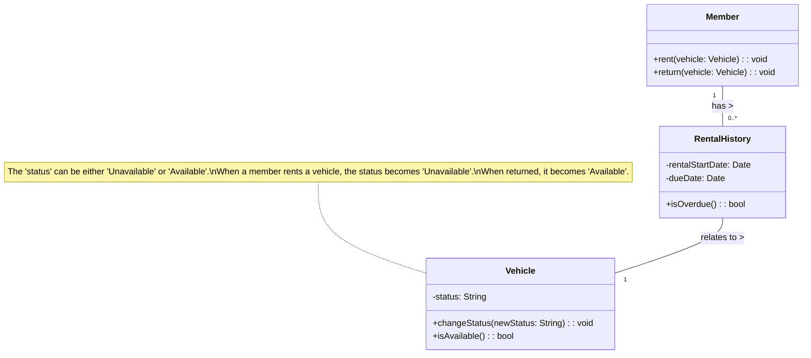

```mermaid
classDiagram

    class Member {
        +rent(vehicle: Vehicle): void
        +return(vehicle: Vehicle): void
    }
    
    class Vehicle {
        -status: String
        +changeStatus(newStatus: String): void
        +isAvailable(): bool
    }
    
    class RentalHistory {
        -rentalStartDate: Date
        -dueDate: Date
        +isOverdue(): bool
    }

    Member "1" -- "0..*" RentalHistory : has >
    RentalHistory -- "1" Vehicle : relates to >

    note for Vehicle "The 'status' can be either 'Unavailable' or 'Available'.\nWhen a member rents a vehicle, the status becomes 'Unavailable'.\nWhen returned, it becomes 'Available'." 

```