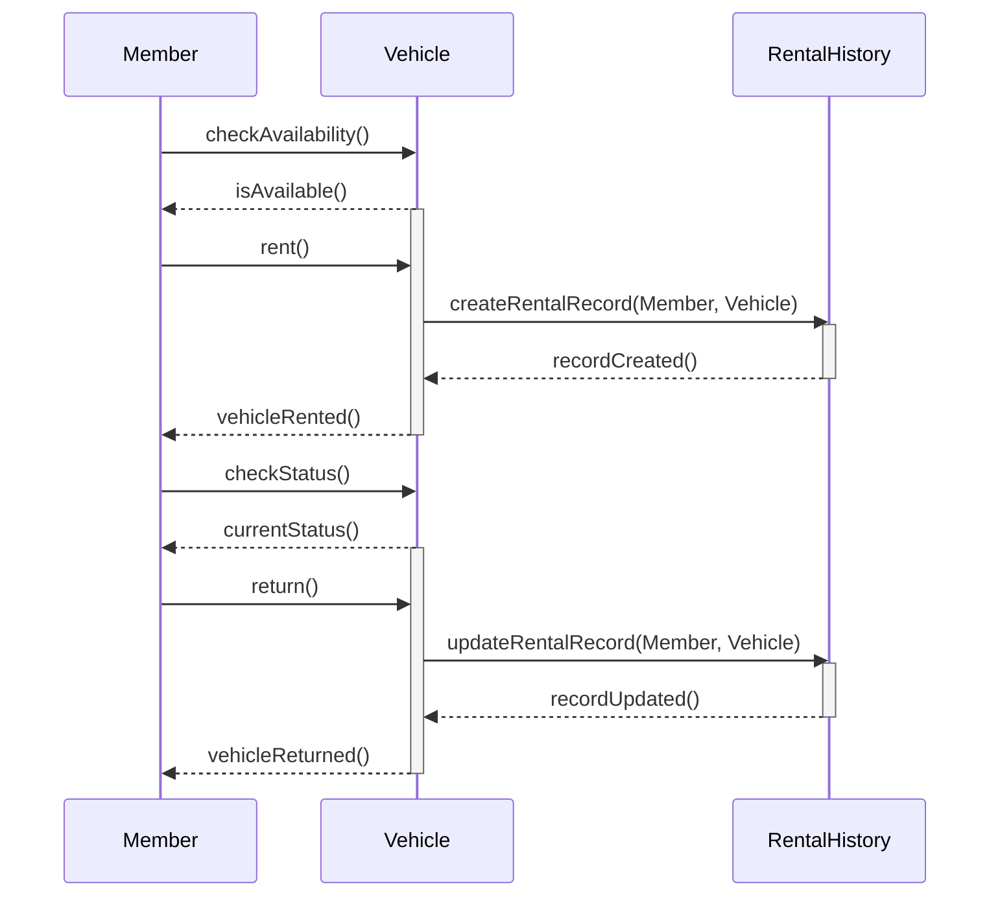

```mermaid
sequenceDiagram

    participant M as Member 
    participant V as Vehicle
    participant RH as RentalHistory 

    M->>V: checkAvailability()
    V-->>M: isAvailable()
    activate V
    M->>V: rent()
    V->>RH: createRentalRecord(Member, Vehicle)
    activate RH
    RH-->>V: recordCreated()
    deactivate RH
    V-->>M: vehicleRented()
    deactivate V

    M->>V: checkStatus()
    V-->>M: currentStatus()
    activate V
    M->>V: return()
    V->>RH: updateRentalRecord(Member, Vehicle)
    activate RH
    RH-->>V: recordUpdated()
    deactivate RH
    V-->>M: vehicleReturned()
    deactivate V
```

